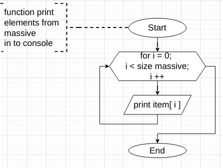

# ControlWorkFirstQuart
# Контрольная работа по итогу прохождения первого блока обучения на программе "Разработчик"

*Само задание можно посмотреть в файле [README123](README123.md)

---
---

## 1. Создание репозитория

В существующем аккаунте [GitHub.com](https://github.com/FA-lex) создаю репозиторий [ControlWorkFirstQuart](https://github.com/FA-lex/ControlWorkFirstQuart), в этом репозитории и будет выложена данная итоговая работа.

По ходу выполнения работы будут делаться "commit"-ы,по которым можно проследить последовательность решения задания.

## 2. Создание блок-схемы будущей программы 

Блок схема программы создается в VSCode с использованием расширения `Draw.io integration` и по окончанию будет сделана конвертация в формат рисунка с расширением `.png` или `.jpg`

Как всякая блак-схема, и моя не исключение, имеет начало: 

По условию задания " `Первоначальный массив можно ввести с клавиатуры, либо задать на старте выполнения алгоритма` ", поэтому у пользователя спрашиваем какой будет вариант. Предварительно указав что вариант нулевой (отсутствующий) и пока пользователь не выберет один из предложенных вариантов будем запрашивать снова: 

Когда пользователь сделает выбор из предложенного, то далее либо запрашиваем массив, либо подсовываем алгоритму заранее подготовленный (взависимости от выбора пользователя).
Если пользователь решил вводить массив вручную - просим вводить элементы через запятую, и затем с помощью функции разделяем введеную строку на элементы и записываем в массив.

Выбор сделан, массив есть, теперь передаем этот массив в функцию поиска элементов массива с длиной менее или равно 3-м символам.

Здесь функцию не выделяю в отдельную блок-схему, т.к. это и есть суть задания, но выделяю ее областью комментария (в программе будет сделано методом).

Алгоритм функции - такой: инициализируем пустую строку в которую будем записывать нужные элементы и счетчик (есть ли такие элементы вообще). Счетчик нужен для того, чтобы первый элемент записать в строку без разделителя, а последующие с разделителем перед элементом. С помощью цикла `for` просматриваем длину каждого элемента массива и подходящие по параметрам записываем в строку через разделитель.

Далее результат выводим пользователю с помощью функции вывода в консоль.

Функция вывода в консольпринимает в себя строку, получившуюся на предъидущем шаге, разбивает её на составляющие через разделитель, формирует массив и выводит в консоль  поэлементно с помощью цикла.

